# Домашнее задание к занятию «docker» — Захаров Роман
ссылка на fork https://github.com/California2018/shvirtd-example-python


### Задача 0

**Описание задания:**
Убедиться, что устаревшая утилита `docker-compose` (с дефисом) не установлена, а современный плагин `docker compose` (без дефиса) установлен и имеет версию не ниже v2.24.X.

**Решение:**
Выполнена проверка установленных версий в системе. Старая версия отсутствует, новая установлена корректно.

```bash
docker-compose --version
docker compose version
```

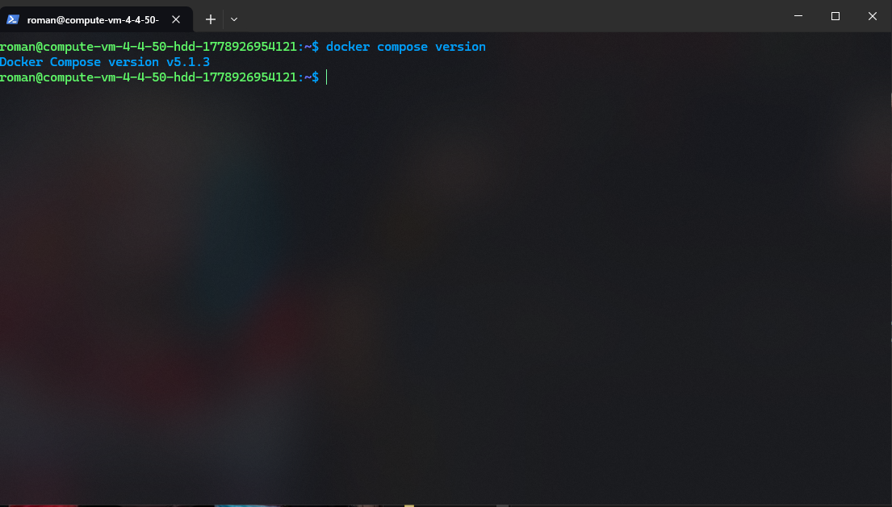


### Задача 1
**Описание задания:**
Сделать fork репозитория. Создать файл .dockerignore и написать Dockerfile.python (multistage сборка на базе python:3.12-slim). Протестировать сборку и запуск веб-приложения.

**Решение:**
Выполнен fork репозитория и клонирование на рабочую ВМ.
Создан файл .dockerignore для исключения лишних файлов из контекста сборки:
```text
.git
__pycache__
*.pyc
venv/
.env
Dockerfile*
```

Создан Dockerfile.python с использованием Multistage-сборки для оптимизации размера итогового образа:


```Dockerfile
FROM python:3.12-slim AS builder
WORKDIR /app
RUN python -m venv /opt/venv
ENV PATH="/opt/venv/bin:$PATH"
COPY requirements.txt .
RUN pip install --no-cache-dir -r requirements.txt


FROM python:3.12-slim
WORKDIR /app
COPY --from=builder /opt/venv /opt/venv
ENV PATH="/opt/venv/bin:$PATH"
COPY . .
CMD ["uvicorn", "main:app", "--host", "0.0.0.0", "--port", "5000"]
```
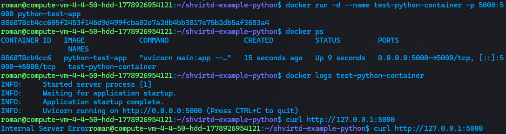


### Задача 3
**Описание задания:**
Создать файл `compose.yaml`, подключить к нему `proxy.yaml` и описать сервисы `web` (Python) и `db` (MySQL 8). Настроить статические IP в bridge-сети `backend`, передать переменные окружения из `.env`. Запустить проект, выполнить HTTP-запрос и проверить создание записи в БД.

**Решение:**
1. Создан файл `compose.yaml` с корректной передачей переменных окружения для связи приложения и БД:
```yaml
include:
  - proxy.yaml

services:
  web:
    build:
      context: .
      dockerfile: Dockerfile.python
    restart: always
    env_file:
      - .env
    environment:
      - DB_HOST=db
      - DB_USER=${MYSQL_USER}
      - DB_PASSWORD=${MYSQL_PASSWORD}
      - DB_NAME=${MYSQL_DATABASE}
    networks:
      backend:
        ipv4_address: 172.20.0.5

  db:
    image: mysql:8
    restart: always
    env_file:
      - .env
    networks:
      backend:
        ipv4_address: 172.20.0.10

networks:
  backend:
    driver: bridge
    ipam:
      config:
        - subnet: 172.20.0.0/24
```
Выполнен запуск проекта и генерация первого запроса 
```bash
docker compose up -d
curl -L http://127.0.0.1:8090
```


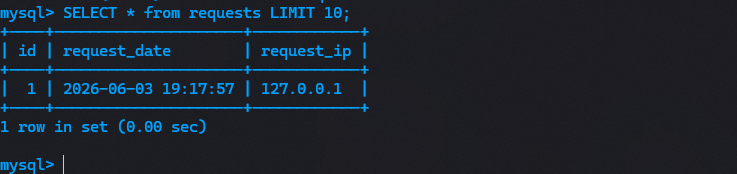

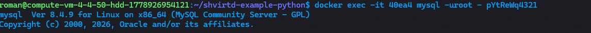


### Задача 4
**Описание задания:**
Написать bash-скрипт для автоматического развертывания проекта из fork-репозитория в директорию /opt. Сгенерировать внешний трафик через сервис check-host.net на публичный IP сервера и проверить записи в БД.

**Решение:**
Создан скрипт автоматического развертывания deploy.sh 
```bash
#!/bin/bash
# Скрипт для автоматического развертывания проекта

echo "=== Шаг 1: Установка Docker (если его нет) ==="
if ! command -v docker &> /dev/null; then
    curl -fsSL https://get.docker.com -o get-docker.sh
    sudo sh get-docker.sh
fi

echo "=== Шаг 2: Клонирование репозитория ==="
cd /opt
sudo rm -rf shvirtd-example-python
sudo git clone https://github.com/California2018/shvirtd-example-python.git

echo "=== Шаг 3: Запуск проекта ==="
cd shvirtd-example-python
# Запускаем docker compose
sudo docker compose up -d

echo "Деплой успешно завершен!"
```

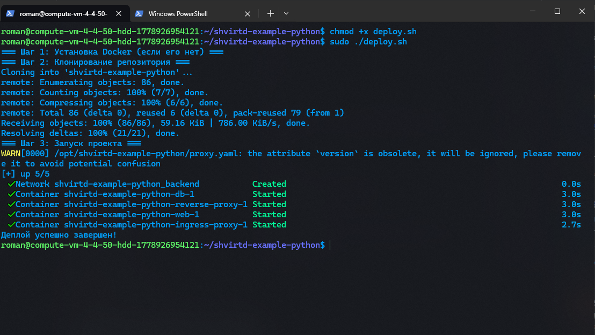
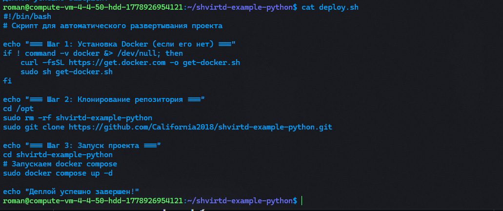
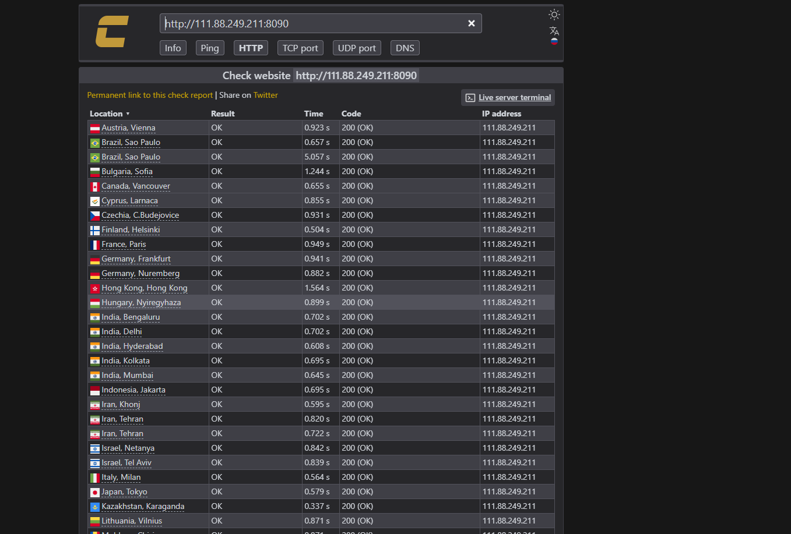
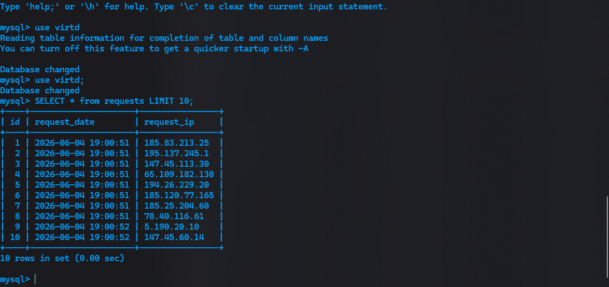


### Задача 6

**Описание задания:**
Скачать образ `hashicorp/terraform:latest`, проанализировать его с помощью утилиты `dive`, сохранить образ в архив (`docker save`) и вручную извлечь бинарный файл `/bin/terraform` на локальную машину.

**Решение:**
1. Выполнено скачивание образа и его анализ через `dive` для поиска расположения файла:
```bash
docker pull hashicorp/terraform:latest
dive hashicorp/terraform:latest
```
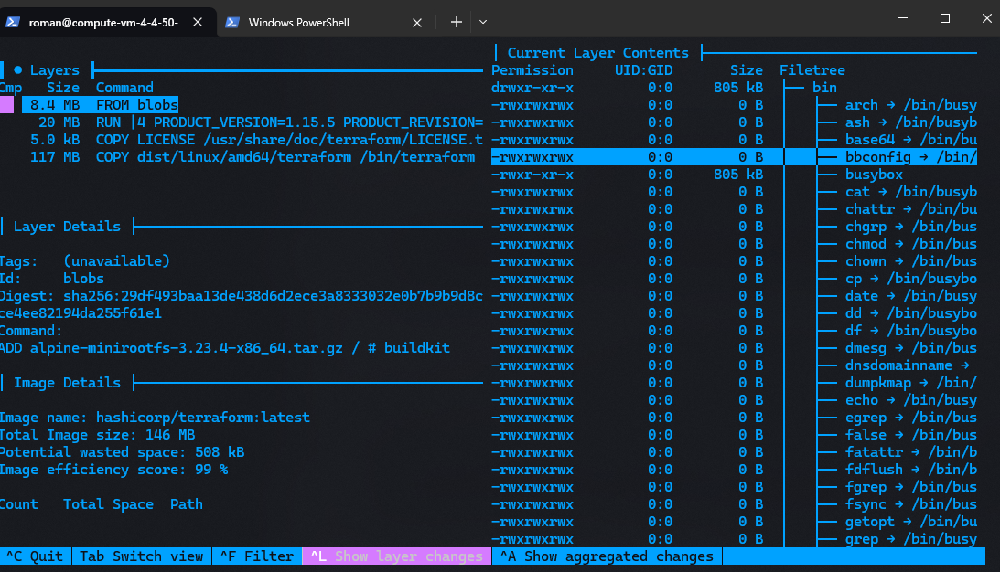
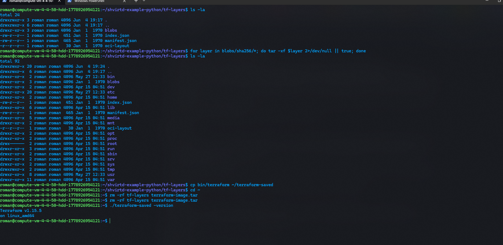


### Задача 6.1

**Описание задания:**
Достать бинарный файл /bin/terraform из образа hashicorp/terraform:latest, используя команду docker cp.

**Решение:**
```bash
# Создание временного контейнера
docker create --name tf-dummy hashicorp/terraform:latest
docker cp tf-dummy:/bin/terraform ~/terraform-cp
docker rm tf-dummy
~/terraform-cp -version
```
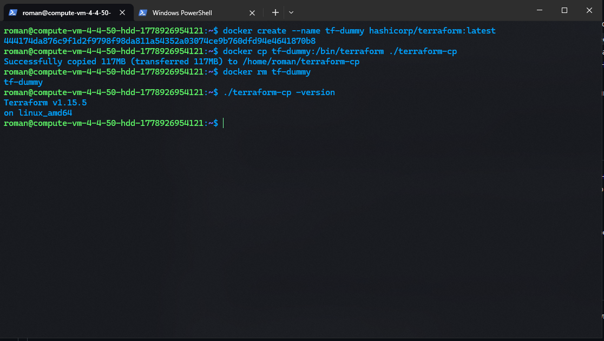